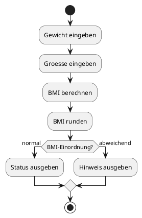
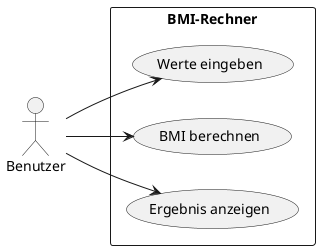

# 01-BMI-Rechner

## Lernziele

- Scanner sicher verwenden
- Werte einlesen und ausgeben
- Variablen und Datentypen passend waehlen
- einfache Operatoren anwenden
- Ergebnisse mit `Math.round()` sinnvoll darstellen
- erste fachliche Rueckmeldung mit `if / else` geben

## Projektbeschreibung

Der BMI-Rechner ist ein typisches Einstiegsthema fuer die Java-Konsolenprogrammierung. Der Lernende fragt Koerpergroesse und Gewicht ab, berechnet daraus den Body-Mass-Index und gibt das Ergebnis in einer klaren Form aus. Das Projekt bleibt bewusst klein, damit der Fokus auf Eingabe, Berechnung und Ausgabe liegt.

## Anforderungen

- Der Benutzer gibt Gewicht in Kilogramm ein.
- Der Benutzer gibt Groesse in Metern ein.
- Das Programm berechnet den BMI mit der bekannten Formel.
- Das Ergebnis wird gerundet ausgegeben.
- Eine einfache Einordnung des Ergebnisses erfolgt mit `if / else`.
- Ungueltige Eingaben werden in der Dokumentation als Randfall beschrieben.

## Beispiel Eingabe und Ausgabe

Beispiel:

- Eingabe: Gewicht = 82.5, Groesse = 1.80
- Ausgabe: BMI = 25.5
- Ausgabe: Einordnung = leichtes Uebergewicht

## UML Activity Diagram

## UML Use Case Diagram

## Umsetzungshinweise

- Erst die Rechenformel in Worten notieren, dann in Java uebertragen.
- Zwischenwerte wie Gewicht, Groesse und BMI sauber benennen.
- Die Ausgabe sprachlich freundlich und eindeutig formulieren.
- Die Reihenfolge Eingabe -> Berechnung -> Ausgabe beibehalten.

## Vorgeschlagene Git-Commit-Historie

- `docs: bmi-rechner aufgabe strukturiert anlegen`
- `docs: beispiele und lernziele ergaenzen`
- `docs: uml-diagramme und hinweise vervollstaendigen`
