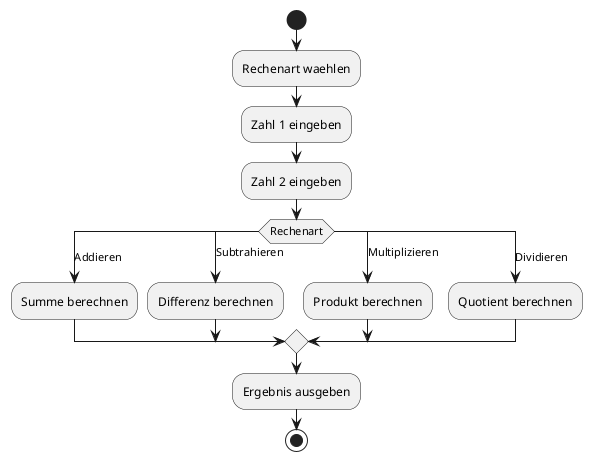
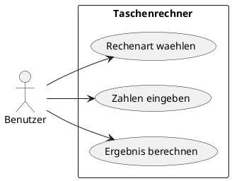

# 02-Taschenrechner

## Lernziele

- Eingaben mit Scanner lesen
- einfache Berechnungen mit Variablen ausfuehren
- Rechenoperatoren gezielt einsetzen
- das Programm mit `switch` strukturieren
- Fehlerfaelle wie Division durch 0 gedanklich absichern
- erste Menuelogik in der Konsole umsetzen

## Projektbeschreibung

Der Taschenrechner erweitert das erste Projekt um eine einfache Auswahl zwischen mehreren Rechenarten. Der Lernende uebt, wie ein Konsolenprogramm Benutzerwuensche entgegennimmt, in einen Programmablauf ueberfuehrt und das Ergebnis sauber zurueckgibt. Das Projekt ist als klassische Einsteigeruebung fuer `switch` geeignet.

## Anforderungen

- Der Benutzer waehlt eine Rechenart aus.
- Das Programm verarbeitet mindestens Addition, Subtraktion, Multiplikation und Division.
- Zwei Zahlen werden eingelesen.
- Das Ergebnis wird direkt ausgegeben.
- Division durch 0 wird in der Dokumentation als Sonderfall beschrieben.
- Die Bedienung bleibt textbasiert und uebersichtlich.

## Beispiel Eingabe und Ausgabe

Beispiel:

- Eingabe: Rechenart = Addition, Zahl 1 = 12, Zahl 2 = 8
- Ausgabe: Ergebnis = 20

## UML Activity Diagram

## UML Use Case Diagram

## Umsetzungshinweise

- Das Menue vor der Berechnung klar anzeigen.
- Jeder Rechenfall sollte in der Dokumentation einzeln beschrieben sein.
- Fuer Division einen Hinweis zu ungueltigen Eingaben notieren.
- Das Projekt eignet sich gut fuer erste Refactorings in Teilaufgaben.

## Vorgeschlagene Git-Commit-Historie

- `docs: taschenrechner grundstruktur anlegen`
- `docs: rechenarten und beispiele praezisieren`
- `docs: menue und sonderfaelle dokumentieren`
