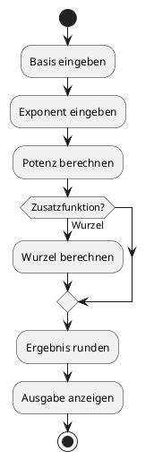
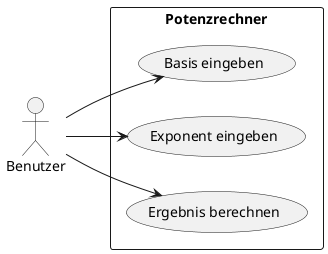

# 03-Potenzrechner

## Lernziele

- mit mathematischen Standardfunktionen arbeiten
- `Math.pow()` fuer Potenzen verwenden
- `Math.sqrt()` als Erweiterung mitdenken
- `Math.round()` fuer lesbare Ergebnisse nutzen
- numerische Eingaben und Ausgabeformate vergleichen
- ein kleines Menue mit `switch` entwerfen

## Projektbeschreibung

Der Potenzrechner vertieft die Rechenlogik und fuehrt in typische Hilfsmethoden der Klasse `Math` ein. Das Projekt bleibt auf eine kleine fachliche Aufgabe reduziert: Eine Basiszahl und ein Exponent werden verarbeitet, optional koennen weitere mathematische Auswertungen in der Dokumentation beschrieben werden.

## Anforderungen

- Der Benutzer gibt eine Basis ein.
- Der Benutzer gibt einen Exponenten ein.
- Das Programm berechnet die Potenz.
- Das Ergebnis wird sinnvoll gerundet ausgegeben.
- Eine optionale Zusatzfunktion fuer die Wurzel wird in der Aufgabenbeschreibung ergaenzt.
- Die Menuestruktur bleibt einfach und fuer Einsteiger nachvollziehbar.

## Beispiel Eingabe und Ausgabe

Beispiel:

- Eingabe: Basis = 2, Exponent = 5
- Ausgabe: Ergebnis = 32

## UML Activity Diagram

## UML Use Case Diagram

## Umsetzungshinweise

- Basis und Exponent vor der Berechnung klar benennen.
- Das Ergebnis der Potenzfunktion in eine lesbare Ausgabe ueberfuehren.
- Falls eine Wurzel ergaenzt wird, den fachlichen Nutzen kurz erklaeren.
- Keine zu komplexen Sonderfaelle einbauen; es bleibt eine Einsteigeraufgabe.

## Vorgeschlagene Git-Commit-Historie

- `docs: potenzrechner aufgabe und ziele anlegen`
- `docs: math-funktionen und beispiele ergaenzen`
- `docs: diagramme und hinweise verfeinern`
