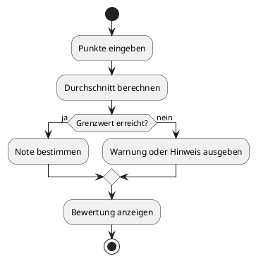
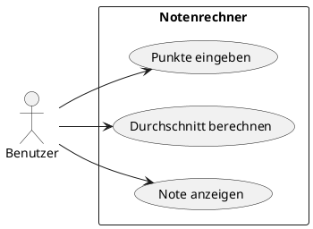

# 04-Notenrechner

## Lernziele

- mit mehreren Eingabewerten arbeiten
- einfache Notenlogik mit `if / else` umsetzen
- Auswahl und Einordnung mit `switch` verbinden
- Rundung und Grenzwerte bewusst betrachten
- Ausgaben fachlich korrekt und freundlich formulieren
- erste kleine Fachlogik als Konsolenprogramm beschreiben

## Projektbeschreibung

Der Notenrechner ist eine typische Schul- und Ausbildungssituation. Mehrere Einzelergebnisse werden zu einer Gesamtnote oder einer Bewertung zusammengefuehrt. Das Projekt trainiert sauberes Denken in Schwellenwerten und nachvollziehbare Entscheidungen im Programmablauf.

## Anforderungen

- Der Benutzer gibt mehrere Punkte oder Notenwerte ein.
- Das Programm bildet einen Durchschnitt oder eine fachlich vereinbarte Gesamtbewertung.
- Die Endnote wird ausgegeben.
- Eine textliche Bewertung wie `bestanden` oder `nicht bestanden` ist moeglich.
- Die Dokumentation erklaert die verwendeten Schwellenwerte.
- Der Aufbau bleibt fuer Anfaenger gut lesbar.

## Beispiel Eingabe und Ausgabe

Beispiel:

- Eingabe: Punktwerte = 85, 78, 90
- Ausgabe: Durchschnitt = 84.3
- Ausgabe: Note = 2

## UML Activity Diagram

## UML Use Case Diagram

## Umsetzungshinweise

- Die Grenzwerte sollten im Text klar dokumentiert sein.
- Der Lernende sollte die Zuordnung von Durchschnitt zu Note in einer Tabelle festhalten.
- Das Projekt eignet sich gut fuer kleine Testfaelle in der Dokumentation.
- Kein ueberladenes Benotungssystem, sondern eine einfache, nachvollziehbare Logik.

## Vorgeschlagene Git-Commit-Historie

- `docs: notenrechner grundidee dokumentieren`
- `docs: punkte und benotungslogik ergaenzen`
- `docs: beispiele und diagramme vervollstaendigen`
