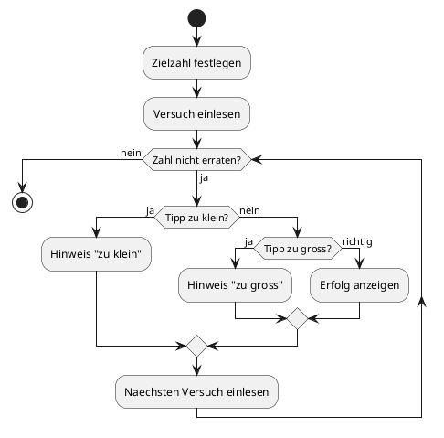
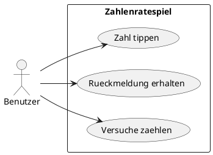

# 05-Zahlenratespiel

## Lernziele

- mit `while`-Schleifen arbeiten
- eine Spielschleife mit Abbruchbedingung entwerfen
- mit `if / else` auf zu hohe oder zu niedrige Eingaben reagieren
- einfache Wiederholungslogik verstehen
- Zustandsvariablen wie Versuche oder Restchancen nutzen
- ein kleines Spiel als Konsolenanwendung planen

## Projektbeschreibung

Das Zahlenratespiel fuehrt in die Logik von wiederholten Eingaben und Rueckmeldungen ein. Der Benutzer erratet eine Zielzahl, und das Programm gibt Hinweise, ob der Tipp zu hoch oder zu niedrig ist. Die Aufgabe ist didaktisch wertvoll, weil der Lernende erstmals einen mehrstufigen Programmfluss mit Rueckkopplung entwirft.

## Anforderungen

- Das Programm arbeitet mit einer vorgegebenen Zielzahl.
- Der Benutzer gibt nacheinander Zahlentipps ein.
- Das Programm gibt Hinweise auf `zu klein`, `zu gross` oder `richtig`.
- Die Schleife endet, wenn die Zielzahl erraten wurde.
- Die Anzahl der Versuche wird mitgefuhrt.
- Die Dokumentation erklaert den Abbruch der Schleife.

## Beispiel Eingabe und Ausgabe

Beispiel:

- Tipp 1: 42 -> zu klein
- Tipp 2: 57 -> zu gross
- Tipp 3: 51 -> richtig

## UML Activity Diagram

## UML Use Case Diagram

## Umsetzungshinweise

- Eine klare Zielzahl und eine einfache Versuchszahl reichen aus.
- Die Rueckmeldung sollte immer eindeutig formuliert sein.
- Ein Spielende mit kurzer Erfolgsnachricht motiviert und bleibt einfach.
- Zusatzregeln wie Punkte oder Highscore sind hier noch nicht noetig.

## Vorgeschlagene Git-Commit-Historie

- `docs: zahlenratespiel aufgabe aufsetzen`
- `docs: while-schleife und feedbacklogik beschreiben`
- `docs: beispielverlauf und diagramme ergaenzen`
