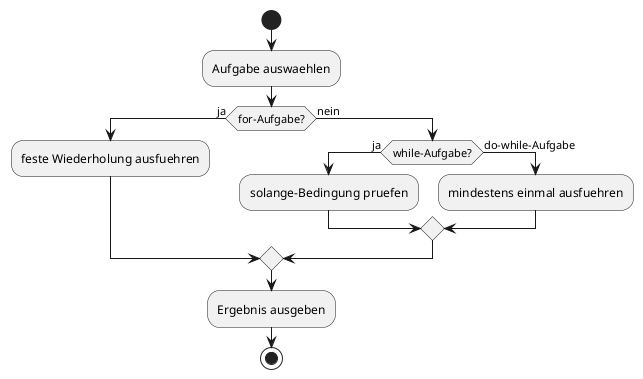
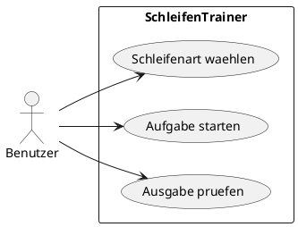

# 06-SchleifenTrainer

## Lernziele

- `for`-Schleifen bewusst einsetzen
- `while`-Schleifen von `do-while` unterscheiden
- Zaehlschleifen und Wiederholungslogik vergleichen
- einfache Aufgaben aus der Mathematik mit Schleifen loesen
- Schleifen sauber dokumentieren und testen

## Projektbeschreibung

Der SchleifenTrainer ist eine reine Uebungsaufgabe fuer Wiederholungen. Er verbindet mehrere kleine Teilaufgaben, zum Beispiel das Ausgeben von Zahlenfolgen, das Summieren von Werten oder einfache Wiederholungsfenster. Der Fokus liegt nicht auf Fachlogik, sondern auf sicherem Umgang mit den drei grundlegenden Schleifenarten.

## Anforderungen

- Mindestens eine Aufgabe pro Schleifenart wird beschrieben.
- Die `for`-Schleife wird fuer feste Wiederholungen genutzt.
- Die `while`-Schleife wird fuer eine abbruchgesteuerte Aufgabe genutzt.
- Die `do-while`-Schleife wird fuer mindestens einen Durchlauf genutzt.
- Fuer jede Teilaufgabe gibt es ein kleines Beispiel.
- Die Dokumentation trennt Aufgaben klar voneinander.

## Beispiel Eingabe und Ausgabe

Beispiel 1:

- Ausgabe: Zahlen von 1 bis 10

Beispiel 2:

- Eingabe: Startwert = 5
- Ausgabe: wiederhole solange der Wert groesser als 0 ist

## UML Activity Diagram

## UML Use Case Diagram

## Umsetzungshinweise

- Jede Schleife sollte mit einem klaren Zweck verknuepft werden.
- Wiederholungszaehler und Abbruchbedingungen getrennt notieren.
- Kleine Uebungsblaetter oder Teilaufgaben helfen beim Lernen.
- Nicht zu viele Sonderfaelle in einen ersten Entwurf packen.

## Vorgeschlagene Git-Commit-Historie

- `docs: schleifentrainer strukturieren`
- `docs: for while do-while aufgaben beschreiben`
- `docs: beispiele und diagramme ergaenzen`
