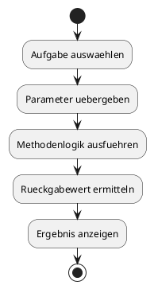
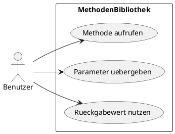

# 07-MethodenBibliothek

## Lernziele

- eigene Methoden planen und benennen
- Parameter sinnvoll uebergeben
- Rueckgabewerte verstehen und dokumentieren
- wiederverwendbare Logik auslagern
- kleine Hilfsfunktionen fachlich sauber beschreiben
- Struktur durch Methode statt durch Copy-Paste erzeugen

## Projektbeschreibung

Die MethodenBibliothek ist eine Sammlung kleiner, thematisch passender Hilfsaufgaben. Der Lernende entwirft einfache Methoden, die zum Beispiel pruefen, berechnen oder formatieren. Das Projekt vermittelt, warum Methoden ein wichtiges Mittel zur Ordnung von Java-Programmen sind.

## Anforderungen

- Es werden mehrere kleine Methoden fachlich beschrieben.
- Mindestens eine Methode mit Parametern wird dokumentiert.
- Mindestens eine Methode mit Rueckgabewert wird dokumentiert.
- Der Zusammenhang zwischen Eingabewerten und Ergebnis wird erklaert.
- Die Dokumentation hebt Wiederverwendbarkeit hervor.

## Beispiel Eingabe und Ausgabe

Beispiel:

- Eingabe: 12 und 4
- Ausgabe: Summe, Differenz, Produkt, Quotient

Beispiel:

- Eingabe: ein Text und ein Grenzwert
- Ausgabe: Wahrheitswert oder kurze Rueckmeldung

## UML Activity Diagram

## UML Use Case Diagram

## Umsetzungshinweise

- Methoden sollen einen klaren Auftrag haben.
- Zu jeder Methode ist ein kurzer Satz zum Zweck hilfreich.
- Parameter und Rueckgabewerte sollten immer fachlich benannt werden.
- Die Dokumentation kann wie ein kleines Nachschlagewerk aufgebaut sein.

## Vorgeschlagene Git-Commit-Historie

- `docs: methodenbibliothek als lernprojekt anlegen`
- `docs: parameter und rueckgabewerte beschreiben`
- `docs: wiederverwendbarkeit und beispiele ergaenzen`
