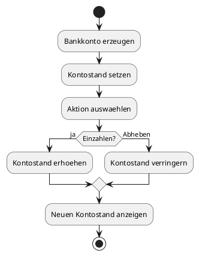
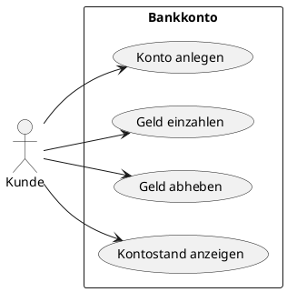

# 08-Bankkonto

## Lernziele

- Klassen und Objekte verstehen
- Konstruktoren sinnvoll einsetzen
- Kapselung mit privaten Attributen anwenden
- einfache Methoden fuer Einzahlen und Abheben planen
- Zustandsaenderungen an einem Objekt nachvollziehen
- erste objektorientierte Fachlogik dokumentieren

## Projektbeschreibung

Das Bankkonto ist der Einstieg in die objektorientierte Denkweise. Statt nur einzelne Werte zu verarbeiten, wird ein Objekt mit eigenem Zustand beschrieben. Der Lernende erkennt, dass ein Konto seinen Kontostand selbst verwaltet und Aenderungen nur ueber definierte Methoden erlaubt.

## Anforderungen

- Ein Bankkonto besitzt einen Kontostand.
- Ein Kontostand wird bei der Erzeugung ueber einen Konstruktor gesetzt.
- Es gibt fachlich einfache Aktionen wie Einzahlen und Abheben.
- Der Zugriff auf interne Werte wird ueber Kapselung geregelt.
- Ueber negative Kontostaende wird fachlich nachgedacht und dokumentiert.

## Beispiel Eingabe und Ausgabe

Beispiel:

- Eingabe: Startguthaben = 1500
- Aktion: 200 einzahlen
- Ausgabe: neuer Kontostand = 1700

## UML Activity Diagram

## UML Use Case Diagram

## Umsetzungshinweise

- Das Konto sollte als eigenes Objekt beschrieben werden.
- Der Kontostand darf nicht unkontrolliert von aussen veraendert werden.
- Die Methoden sollten klare Fachnamen haben.
- Ein kleiner Satz zur fachlichen Plausibilitaet gehoert in die Dokumentation.

## Vorgeschlagene Git-Commit-Historie

- `docs: bankkonto objektmodell anlegen`
- `docs: konstruktor und kapselung erklaeren`
- `docs: kontoaktionen und beispiele ergaenzen`
