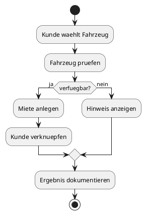
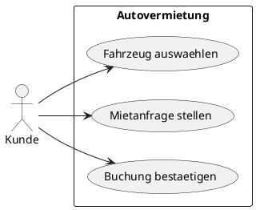

# 09-Autovermietung

## Lernziele

- mehrere Klassen in Beziehung setzen
- Vererbung in einer einfachen Fachdomane erkennen
- Assoziationen zwischen Objekten beschreiben
- Konstruktoren und Kapselung wiederholen
- einfache Fachobjekte wie Fahrzeug und Kunde unterscheiden
- Objektmodelle strukturiert dokumentieren

## Projektbeschreibung

Die Autovermietung ist das erste groessere Objektmodell der Reihe. Hier werden mehrere Rollen und Objekte miteinander verbunden, zum Beispiel Fahrzeug, Kunde und Mietvorgang. Das Projekt bleibt bewusst leichtgewichtig und verzichtet auf komplexe Fachprozesse, damit die Vererbung und die Beziehungen zwischen den Klassen im Vordergrund stehen.

## Anforderungen

- Es gibt mindestens eine Fahrzeug-Basisidee.
- Es gibt mindestens eine Spezialisierung ueber Vererbung, zum Beispiel PKW oder Transporter.
- Ein Kunde steht in Beziehung zu einer Miete oder Buchung.
- Die Klassen werden klar voneinander abgegrenzt.
- Die fachlichen Regeln bleiben einfach und realistisch.
- Die Dokumentation erklaert die Beziehungen zwischen den Objekten.

## Beispiel Eingabe und Ausgabe

Beispiel:

- Eingabe: Fahrzeugtyp = PKW, Mietdauer = 3 Tage
- Ausgabe: Mietanfrage bestaetigt

Beispiel:

- Eingabe: Kunde = Max Mustermann
- Ausgabe: Verknuepfung mit einer Buchung

## UML Activity Diagram

## UML Use Case Diagram

## Umsetzungshinweise

- Eine klare Trennung zwischen Fahrzeug, Kunde und Miete hilft beim Verstaendnis.
- Vererbung nur dort verwenden, wo sie fachlich sichtbar ist.
- Die Dokumentation sollte die Assoziationen in Worten erklaeren.
- Keine realen Tarifrechner oder komplizierten Zusatzregeln einbauen.

## Vorgeschlagene Git-Commit-Historie

- `docs: autovermietung objektmodell skizzieren`
- `docs: vererbung und assoziationen beschreiben`
- `docs: beispiele und uml-diagramme vervollstaendigen`
