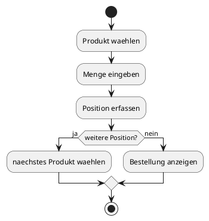
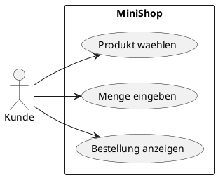

# 10-MiniShop

## Lernziele

- ein kleines Fachmodell aus mehreren Klassen verstehen
- Objekte miteinander verknuepfen
- Kapselung wiederholen und festigen
- einfache Ablauflogik mit Methoden und Schleifen beschreiben
- eine alltagsnahe Anwendung aus Sicht des Lernens dokumentieren
- saubere Portfolio-Darstellung als Abschlussprojekt vorbereiten

## Projektbeschreibung

Der MiniShop ist das Abschlussprojekt der Reihe. Er verbindet mehrere grundlegende Themen in einer kleinen, alltagsnahen Anwendung. Der Lernende beschreibt Produkte, einen einfachen Warenkorb oder eine kleine Bestellung. Das Projekt ist bewusst bescheiden gehalten, damit der Fokus weiterhin auf den Grundlagen von Java liegt.

## Anforderungen

- Es gibt mindestens eine Produktidee.
- Es gibt eine einfache Bestell- oder Warenkorbidee.
- Die Klassen sind klar voneinander abgegrenzt.
- Die Dokumentation erklaert, welche Objekte miteinander arbeiten.
- Die Bedienung bleibt fuer Einsteiger nachvollziehbar.
- Es werden keine komplexen Shop-Funktionen wie Zahlung oder Datenbankanbindung vorgesehen.

## Beispiel Eingabe und Ausgabe

Beispiel:

- Eingabe: Produkt = Notizblock, Menge = 2
- Ausgabe: Zwischensumme wird berechnet

Beispiel:

- Eingabe: weitere Position hinzufuegen
- Ausgabe: aktualisierte Bestelluebersicht

## UML Activity Diagram

## UML Use Case Diagram

## Umsetzungshinweise

- Der MiniShop soll nicht wie ein echtes E-Commerce-System wirken.
- Wenige Klassen reichen aus, wenn sie sauber erklaert sind.
- Der Warenkorb kann als einfache Assoziation zwischen Produkt und Bestellung beschrieben werden.
- Der Abschluss soll die bisher gelernten Grundkonzepte sichtbar zusammenfuehren.

## Vorgeschlagene Git-Commit-Historie

- `docs: minishop als abschlussprojekt anlegen`
- `docs: klassen und bestelllogik beschreiben`
- `docs: portfolioabschluss mit beispielen und diagrammen`
